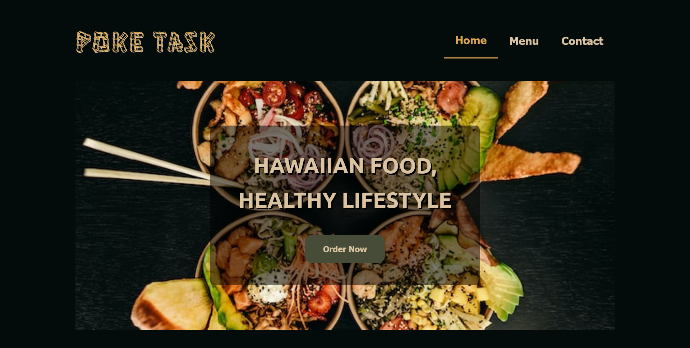

# Restaurant Project

    

<a href="https://odin-restaurant-project.netlify.app/">Live Demo </a>

## About The Project

I`ve done this project as part of the [Odin Project](https://www.theodinproject.com/lessons/node-path-javascript-restaurant-page) curriculum

- Static website for a fictitious restaurant
- All the website content is created trhough JavaScript
- The purpose of this project is to practice ES6 modules and to learn how to use webpack

## Built With

- HTML 5
- CSS
- JavaScript
- Webpack

## Resources Used

- [Unsplash](https://unsplash.com/) - Images
- [Google Fonts](https://fonts.google.com/knowledge) - Typography
- [FontAwesome](https://fontawesome.com/) - Icons
